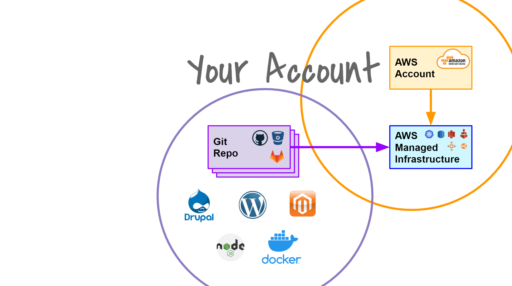
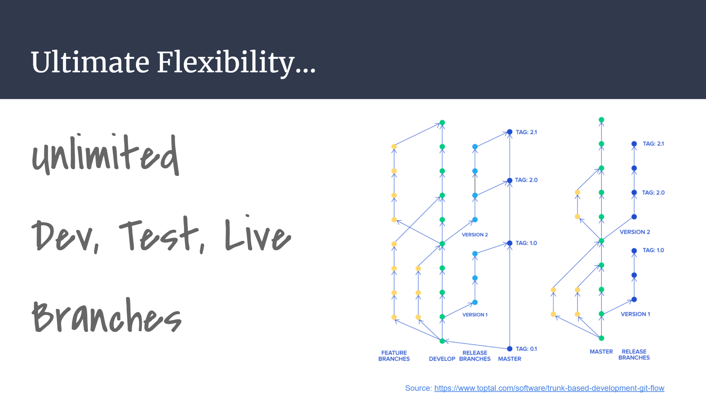
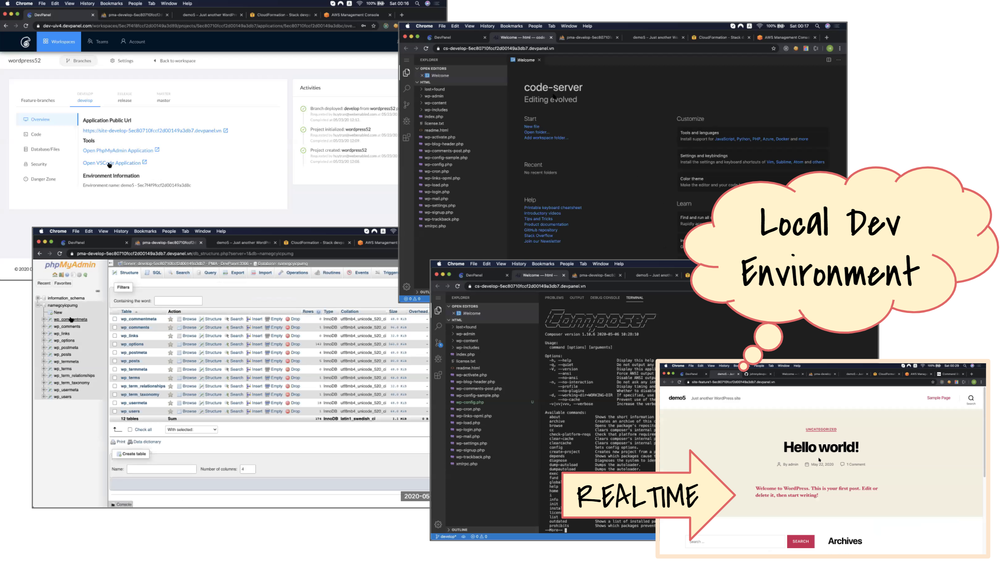
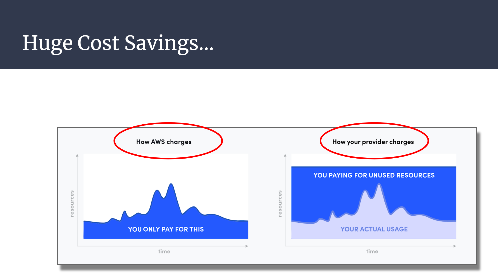
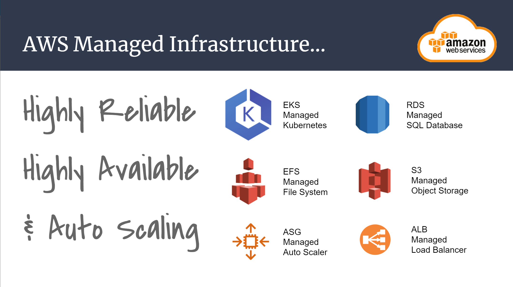
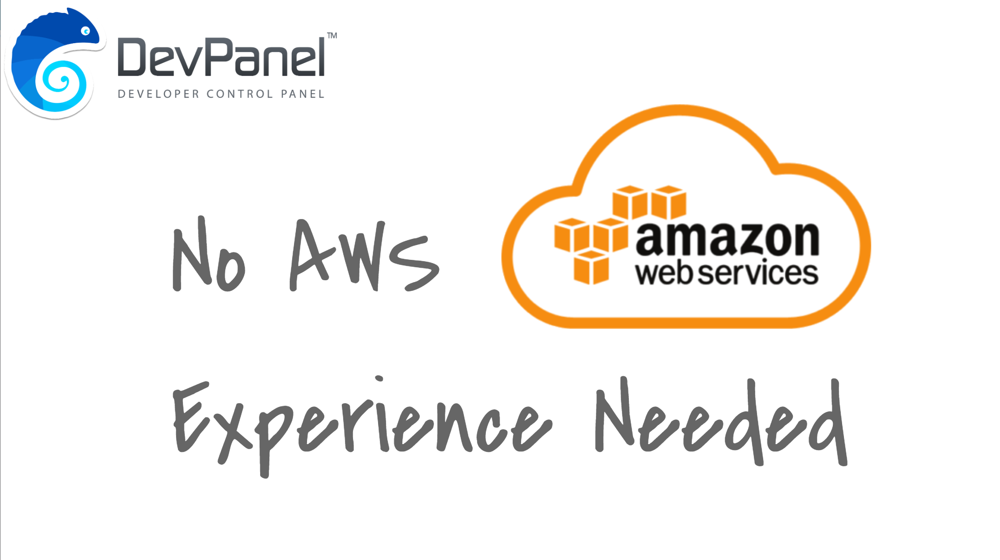

# How DevPanel Works
Here's a high-level overview of how DevPanel works...

## Develop in your own AWS account

DevPanel first links to your AWS account and creates infrastructure there that it manages.

Then, DevPanel deploys applications in that infrastructure using code from your repos.

## Create unlimited Dev, Test, Live branches

Use GitFlow and Trunk based development methodology, invite as many team members as you like and create as many Feature branches as you like. 

## Browser Based Development

Develop anywhere and anytime using just a browser. With every application, you get all the development tools to develop and manage your application using just a browser. 

VS Code (Code Server) in a Browser - Microsoft's Visual Studio Code IDE 
PHP My Admin - Database management tool

With DevPanel, you don't need a Local Dev Environment. You can do everything in a browser. However, if you like your LDE, then DevPanel works with all LDEs equally just as well.

## Pay AWS Directly

With DevPanel, you pay AWS directly and only for what you use. There's no middle-man.

## Enterprise Grade Infrastructure

Your applications and sites run on Highly Reliable, Highly Available and Auto Scaling AWS Managed Infrastructure.

## No AWS Experience Needed!

DevPanel manages your entire AWS account from start to finish so you don't need to know any AWS. We also provide 24 x 7 support in case you need help.

## Try DevPanel Today

Contact us to get a Free Trial account to see if DevPanel is right for you.

